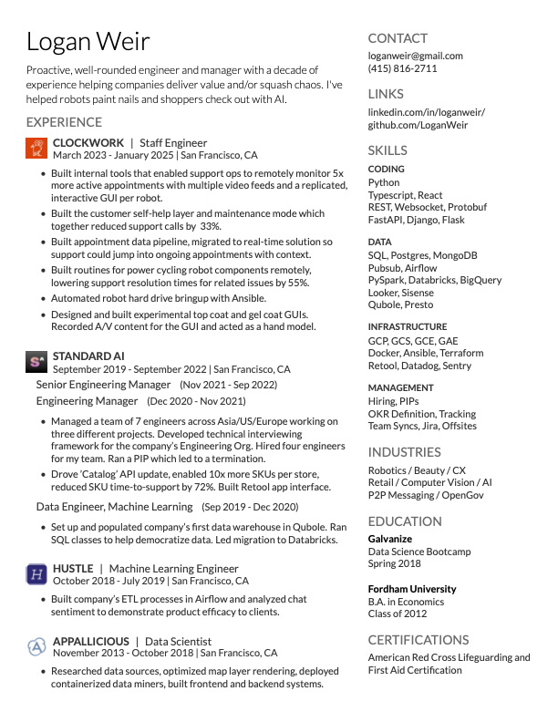

Logan-Resume
=========================

A **one-page**, **two asymmetric column** resume template in **XeTeX**.
Uses free, clean fonts - *Lato* (and its various variants) and *Raleway*.

It is licensed under the Apache License 2.0.

# Motivation

Wanted to use LaTeX to more easily adapt my resume to job postings, and I was tried of Figma installing login items on my system.

This is a fork of [Deedy-Resume-Reversed by ZDTaylor](https://github.com/ZDTaylor/Deedy-Resume-Reversed).

Built with the help of Aider and Gemini

# Usage

`./bin/build {all|g|be|fs|de}`

Build options are either `all` (self-explanatory), `be` (backend eng), `fs` (fullstack eng), `de` (data eng), or `g` (general)

# Dependencies

Compiles with **XeTeX**

# Known Issues:
1. Completely overflows onto second page if any column's contents are more than the vertical limit
2. Hacky fix for 'Experience' Title having mystery space beneath it

# Output

## License
    Original Work Copyright 2014 Debarghya Das
    Modified Work Copyright 2018 Zachary Taylor
    Modified Work Copyright 2025 Logan Weir

    Licensed under the Apache License, Version 2.0 (the "License");
    you may not use this file except in compliance with the License.
    You may obtain a copy of the License at

       http://www.apache.org/licenses/LICENSE-2.0

    Unless required by applicable law or agreed to in writing, software
    distributed under the License is distributed on an "AS IS" BASIS,
    WITHOUT WARRANTIES OR CONDITIONS OF ANY KIND, either express or implied.
    See the License for the specific language governing permissions and
    limitations under the License.
 